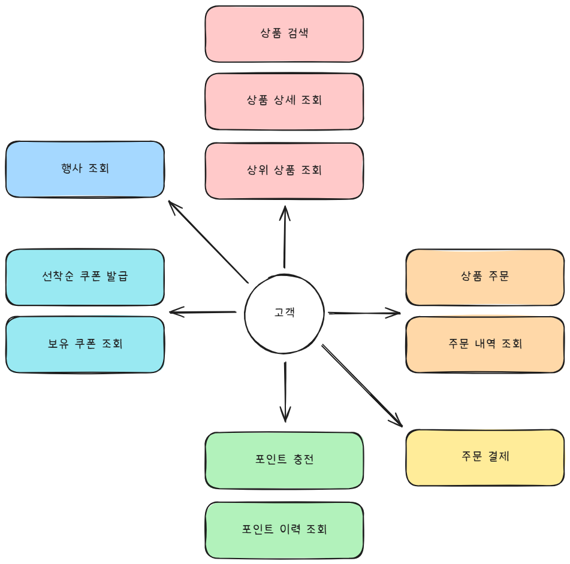
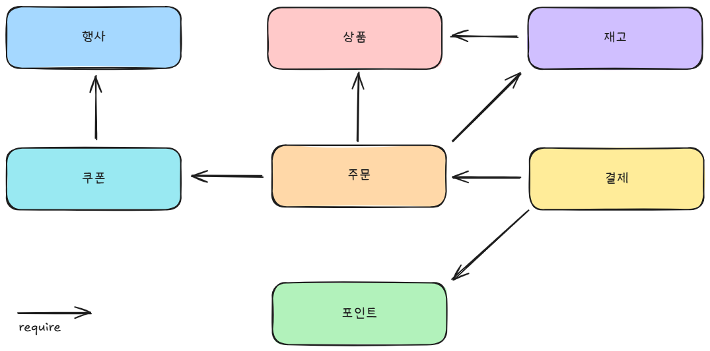

# 요구사항

e-커머스 시스템을 구현한다.

## 유스케이스

### 상품 검색

* 상품 검색 조건이 유효한지 검증
* 페이지네이션을 적용

### 상품 상세 조회

* 존재하는 상품인지 검증

### 상위 상품 조회

* 최근 7일 동안 가장 많이 판매된 상품 목록을 조회
* 페이지네이션을 적용

### 상품 주문

* 존재하는 상품인지 검증
* 상품 재고가 충분한지 검증
* 쿠폰을 사용할 수도 안 할 수도 있음
* 쿠폰을 사용했다면 보유한 쿠폰이 맞는지, 이미 사용된 쿠폰인지, 만료된 쿠폰인지, 해당 상품에 사용할 수 있는 쿠폰인지 검증
* 재고 수 감소
* 쿠폰을 사용했다면, 쿠폰 사용 처리
* 주문 내역을 저장
* 일정 시간 내에 결제되지 않은 주문은 취소

### 주문 내역 조회

* 사용자의 주문 내역 조회
* 페이지네이션을 적용

### 주문 결제

* 취소된 주문이 아닌지 검증
* 보유 포인트가 충분한지 검증 (주문 시에 검증하지 않음)
* 최종 결제할 금액만큼 포인트 차감
* 데이터 플랫폼에 주문 정보 전송
* 결제되면 주문 완료로 간주
* 주문이 취소되면 자원 롤백(재고 수 증가, 쿠폰 미사용 처리), 주문 상태 변경

### 포인트 충전

* 충전 액수가 양수인지 검증
* 미리 정해진 충전 금액(1000원, 5000원, 10000원 등)인지 검증
* 보유 포인트 증가
* 포인트 이력 저장

### 포인트 이력 조회

* 사용자의 포인트 이력 조회
* 포인트 출처(사용자, 행사, 시스템)가 필요

### 선착순 쿠폰 발급

* 존재하는 쿠폰인지 검증
* 발급 기간이 지난 쿠폰인지 검증
* 남은 수량이 있는지 검증
* 이미 발급했는지 검증
* 사용자에게 쿠폰 추가

### 보유 쿠폰 조회

* 사용자의 보유 쿠폰 조회

### 행사 조회

* 현재 진행하는 행사를 조회
* 선착순 쿠폰, 특정 상품에 한해 할인 쿠폰, 웰컴 쿠폰, 친구 초대 포인트

## 도메인 다이어그램

### 도메인 정책

#### 상품

* 상위 상품은 매일 00:00 기준 7일 동안 가장 많이 판매된 상품을 말한다.

#### 주문

* 주문 후 10분 내로 결제하지 않으면 주문이 취소된다.
* 주문이 취소되어야 쿠폰, 재고가 복구된다. 이는 

#### 쿠폰

* 동일한 쿠폰은 사용자당 하나씩만 발급할 수 있다.
